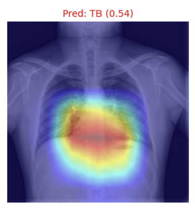
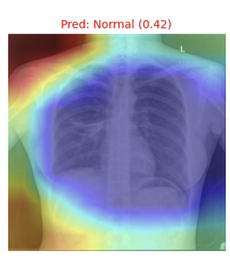

# TCL-CXR

Independent Research Project

A self-supervised medical imaging project investigating whether Twin Contrastive Learning improves label-efficient tuberculosis detection from chest X-rays.

## 1. Experimental Intent & Motivation
In the medical imaging domain, acquiring large-scale expert-annotated data is highly expensive and time-consuming. While transfer learning from ImageNet is a standard practice, it often suffers from severe domain shift and class-prediction bias when applied to CXR tasks with minimal labeled data.
The primary intent of this study is to:
1. Validate Unsupervised Pretraining: Demonstrate that domain-specific self-supervised pretraining on unlabeled CXRs provides a robust initialization.
2. Dissect Twin-Contrastive Learning (Ablation Study): Deconstruct the TCL objective into its core components (Instance-level Contrastive Head and Cluster-level Contrastive Head) to understand their synergistic contributions.
3. Ensure Explainability & Trust: Use Grad-CAM to verify if the model makes clinical decisions based on actual pathological features rather than dataset-specific artifacts.

### Research Question
Can Twin Contrastive Learning improve label-efficient tuberculosis detection from chest X-rays while producing more stable representations than conventional transfer learning?

## 2. Experimental Design

### Datasets
| Dataset          | Purpose                 | Images  |
| ---              | ---                     | ---     |
| NIH ChestX-ray14 | SSL pretraining         | 112,120 |
| Shenzhen         | TB fine-tuning          | 662     |
| Montgomery       | Cross-domain evaluation | 138     |

### Methodology
- Backbone: Xception (via timm library).
- Domain-Specific Augmentation: Custom data augmentation pipeline preventing extreme geometric distortions
  - Rotation & Translation: RandomAffine(degrees=5, translate=(0.02, 0.02)) to simulate slight patient positioning shifts.
  - Lesion Preservation Crop: RandomResizedCrop(scale: 0.8–1.0) strictly bounded to prevent cutting out peripheral lung nodules.
  - Exposure Simulation: ColorJitter(brightness=0.2, contrast=0.2, p=0.5) applied with a 50% probability.
  - Sensor Noise Simulation: GaussianBlur(kernel_size=3, p=0.5) applied with a 50% probability.
- Multi-Seed Validation: All downstream evaluations are cross-validated across 3 random seeds (42, 77, 123) to observe decision boundary variance.

### Ablation Strategy
I decoupled the loss function to train three separate pre-trained models for 50 epochs:
1. ICH-Only: Learns instance discrimination.
2. CCH-Only: Learns cluster-level representation.
3. TCL-Full (ICH + CCH): Learns both simultaneously.

## 3. Results

### A. Baseline Comparison: ImageNet vs. TCL (Ours)
| Data Fraction | Model               | AUROC (Mean ± Std) | F1-Score (Mean ± Std) |
| ---           | ---                 | ---                | ---             |
| 10%           | Baseline (ImageNet) | 0.8422 ± 0.0138    | 0.7139 ± 0.0627 |
|               | TCL (Ours)          | 0.7729 ± 0.0316    | 0.6639 ± 0.0276 |
| 25%           | Baseline (ImageNet) | 0.8740 ± 0.0153    | 0.7971 ± 0.0131 |
|               | TCL (Ours)          | 0.8038 ± 0.0224    | 0.7638 ± 0.0227 |
| 50%           | Baseline (ImageNet) | 0.8938 ± 0.0052    | 0.8311 ± 0.0050 |
|               | TCL (Ours)          | 0.8756 ± 0.0132    | 0.8116 ± 0.0048 |
| 100%          | Baseline (ImageNet) | 0.9179 ± 0.0029    | 0.8563 ± 0.0084 |
|               | TCL (Ours)          | 0.9186 ± 0.0153    | 0.8397 ± 0.0125 |
Analysis: While ImageNet achieved higher mean performance in most low-label settings, TCL generally produced more consistent optimization in F1-score across random seeds, particularly in the most data-constrained regime.

### B. Ablation Study Results (10% Labeled Data, 3-Seed Average)
| Model Architecture | AUROC (Mean ± Std) | F1-Score (Mean ± Std) |
| ---                | ---                | ---             |
| ICH_Only           | 0.7332 ± 0.0401    | 0.6948 ± 0.0255 |
| CCH_Only           | 0.8444 ± 0.0046    | 0.6494 ± 0.0621 |
| TCL_Full (ICH+CCH) | 0.7934 ± 0.0138    | 0.7403 ± 0.0185 |

## 4. Interpretation & Discussion

### The Synergy of ICH and CCH
The experiments indicate that combining both objectives produces more stable representations.
- The CCH Collapse: When pre-training with CCH alone, the model failed to extract meaningful features, resulting in an immediate mathematical collapse (Loss converging to ln(1024) ≒ 6.93). Although CCH-Only achieved a relatively high AUROC during fine-tuning, its substantially lower F1-score and higher variance suggest that the learned representation did not translate into consistently balanced classification performance. This discrepancy suggests that AUROC alone can overestimate representation quality, whereas F1 and variance reveal instability under class-imbalanced low-data conditions.
- TCL_Full Superiority: The ICH provides the essential baseline feature space, while CCH acts as a regularizer that groups similar pathologies.

### Visual Explainability & Shortcut Learning (Grad-CAM)
Despite the TCL_Full model achieving the most stable classification metrics, Grad-CAM visualization uncovered a critical limitation in low-data fine-tuning.

<table>
<tr>
<td align="center">
<br>
<b>Central Bias (Heart Shadow)</b>
</td>
<td align="center">
<br>
<b>Boundary Bias (Background Shortcut)</b>
</td>
</tr>
</table>

Heatmap analysis revealed that the model rarely localized its attention on the lung parenchyma where actual TB lesions reside. Instead, it relied heavily on two shortcut patterns:
1. Central Bias: Over-focusing on the heart shadow (as seen in the left image).
2. Boundary Bias: Fixating on the clavicle or external black borders (as seen in the right image).

Conclusion: High AUROC/F1 scores do not guarantee clinical reliability. This validates that in extremely low-data regimes (10%), TCL provides stability but is still vulnerable to Shortcut Learning. Future work must evaluate whether lung-field constraints (e.g., semantic segmentation masks) could guide the model's attention while preserving label efficiency.

## 5. Repository Structure
```text
TCL-CXR/
├── assets/
│   └── images/
│       ├── pipeline.png
│       ├── performance_curve.png
│       ├── gradcam_central_bias.png
│       └── gradcam_boundary_bias.png
├── data_loader.py
├── model.py
├── pretrain_ablation.py
├── finetune_ablation.py
├── gradcam_vis.py
└── README.md

## 6. Reproducibility

### Environment
- Python 3.11
- PyTorch 2.x
- timm
- torchvision

### Quick Start

```bash
# 1. Pretraining (Runs ICH, CCH, and BOTH sequentially for 50 epochs)
python pretrain_ablation.py

# 2. Fine-tuning (Evaluates 10% data across 3 random seeds automatically)
python finetune_ablation.py

# 3. Grad-CAM Visualization (Generates Heatmaps)
python gradcam_vis.py

```
